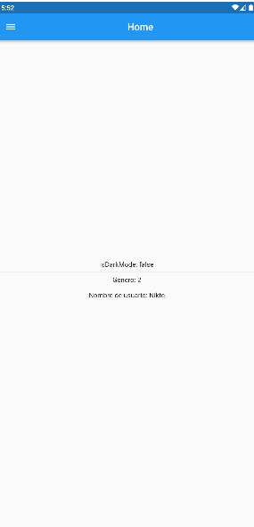
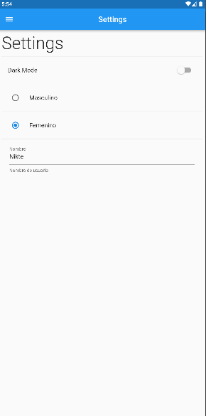
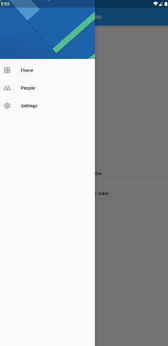

# Preferencias LLave valor App 

Demo para guardar preferecias de usuario (llave, valor) con [shared_preferences](https://pub.dev/packages/shared_preferences) en flutter. 

## Caracteristicas

* Uso de Drawer (Menu hamburguesa)
* Guarda algunos datos de ejemplo para las preferencias de usuario.
* Cambia y mantiene el modo oscuro a claro permanentemente.

## Vista previa

## Cómo usar
1. Clonar el proyecto.
2. Descargar las dependencias.
3. Ejecutar el proyecto.
